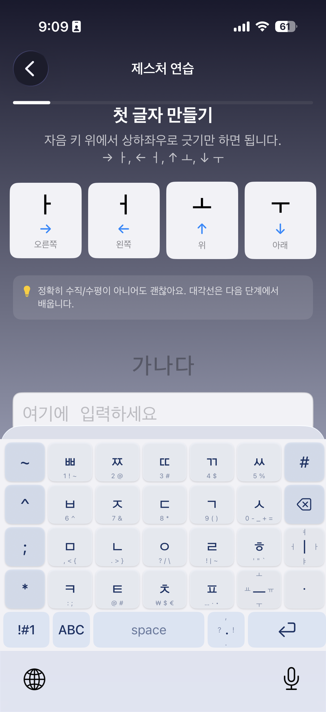
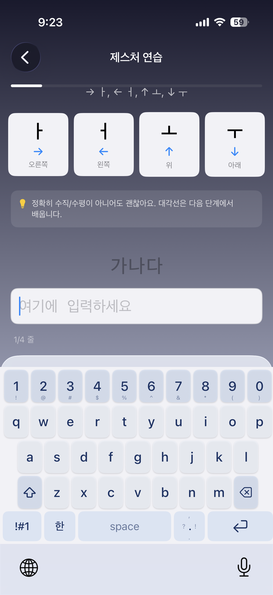
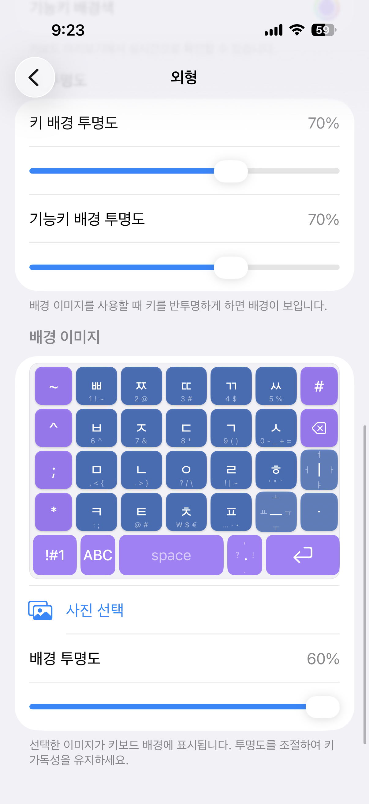

# 모아+

> 손끝으로 완성하는 한글 — 제스처 기반 iOS 한글 키보드

자음 키 위에서 방향을 긋기만 하면 모음이 입력됩니다. 21개 모음을 8방향 제스처 조합으로 빠르게 입력할 수 있는 모아키 방식 키보드입니다.

**v1.3 신규**: Shift 길게 누르기로 Caps Lock 토글, 단축어 전체 ON/OFF 스위치, 컬럼별 방향 전환 거리 보정 슬라이더, 디바이스 폭에 비례하는 제스처 거리, App Group 동기화 + 메모리 안정성 강화.

**v1.2**: 영문 QWERTY 키보드, 천지인 모음 입력(ㅣ·점·ㅡ), 스페이스바 드래그로 커서 이동, 통합 제스처 설정 화면.

> Based on [ios-moaki](https://github.com/vkehfdl1/ios-moaki) by Jeffrey (Dongkyu) Kim

## 스크린샷

### v1.2 — 키보드와 외형 미리보기

| 한글 키보드 | 영문 키보드 | 외형 미리보기 |
|:--:|:--:|:--:|
|  |  |  |

### 메인 앱

| 홈 | 설정 | 튜토리얼 | 단축어 | 앱 정보 |
|:--:|:--:|:--:|:--:|:--:|
|  |  |  |  |  |

## 주요 기능

### 입력
- **제스처 모음 입력** — 자음 키 위 8방향 긋기로 21개 모음 입력
- **천지인 모음 입력** (v1.2) — 우측 ㅣ · 점 · ㅡ 키만으로 모든 모음 조합 (점+점+ㅣ → ㅕ 등)
- **영문 QWERTY 모드** (v1.2) — 한영 키로 즉시 전환, Shift 더블탭 또는 **길게 누르기**(v1.3)로 Caps Lock
- **롱프레스 보조 입력** — 길게 누르면 숫자/기호, 드래그로 후보 선택
- **영문 숫자 특수문자** (v1.2) — 영문 모드에서 1~0 키 길게 누르면 ! @ # $ % ^ & * ( )
- **약어 확장** — 자음 몇 개로 긴 문장을 빠르게 입력 (예: ㅇㅎ → 확인했습니다)
- **약어 전체 ON/OFF** (v1.3) — 등록 데이터는 보존하면서 자동 확장만 일시 정지, 입력 직후 백스페이스로 원래 글자 복원

### 편집
- **스페이스 드래그 커서** (v1.2) — 스페이스바를 좌우로 드래그해 커서 이동
- **자동 괄호 닫기** — `(`, `[`, `{`, `「` 등을 입력하면 닫는 짝을 자동 삽입
- **단어 단위 삭제** — 백스페이스 롱프레스 시 단어 단위 빠른 삭제

### 커스터마이징
- **커스텀 테마** — 5가지 프리셋 + 커스텀 색상 + 배경 이미지 + 키 투명도
- **통합 제스처 설정** (v1.2) — 각도, 길이, 방향 매핑, 열별 보정을 한 화면에서 관리
- **방향 전환 거리 보정** (v1.3) — 컬럼별 슬라이더로 ㅗ → ㅘ 같은 끝 휨 오인식을 사용자가 직접 튜닝
- **디바이스 비례 굿기 거리** (v1.3) — 키 폭에 비례한 임계값으로 SE부터 Pro Max까지 손맛 일관
- **라이브 제스처 시각화** (v1.2) — 실제 키보드와 동일한 엔진으로 제스처를 직접 시험
- **타이핑 연습** (v1.2) — 천지인, 영문, 커서 이동 등 33종 시나리오

### 프라이버시
- **완전 오프라인** — 네트워크 미사용, 입력 데이터 수집 없음
- **풀 액세스 불필요** (v1.2부터) — App Group만으로 설정 공유. iOS의 "전체 접근 허용" 경고 없음

## 제스처 가이드

자음 키 위에서 드래그하여 모음을 입력합니다.

### 기본 모음 + 대각선

| 방향 | 모음 | 방향 | 모음 |
|------|------|------|------|
| → | ㅏ | ↗ ↖ | ㅣ |
| ← | ㅓ | ↘ ↙ | ㅡ |
| ↑ | ㅗ | | |
| ↓ | ㅜ | | |

> 대각선 매핑은 설정에서 변경할 수 있습니다.

### Y-모음 (왕복)

| 방향 | 모음 | 방향 | 모음 |
|------|------|------|------|
| →←→ | ㅑ | ↑↓↑ | ㅛ |
| ←→← | ㅕ | ↓↑↓ | ㅠ |

### 복합 모음

| 방향 | 모음 | 방향 | 모음 |
|------|------|------|------|
| ↑→ | ㅘ | →← | ㅐ |
| ↓← | ㅝ | ←→ | ㅔ |
| ↑↓ | ㅚ | →←→← | ㅒ |
| ↓↑ | ㅟ | ←→←→ | ㅖ |
| ↑→← | ㅙ | ↘↖ | ㅢ |
| ↓→← | ㅞ | | |

## 키보드 배열

### 한글 모드 (v1.2)

```
 ~  ㅃ ㅉ ㄸ ㄲ ㅆ  #
 ^  ㅂ ㅈ ㄷ ㄱ ㅅ  ⌫
 ;  ㅁ ㄴ ㅇ ㄹ ㅎ  ㅣ
 *  ㅋ ㅌ ㅊ ㅍ  ㅡ  ㆍ
 123  한/영  [스페이스 (드래그→커서)]  .  ⏎
```

우측 컬럼의 **ㅣ, 점(ㆍ), ㅡ**는 천지인 모음 입력용 키입니다. 단독 탭이나 8방향 드래그, 그리고 점 누적 합성(점+점+ㅣ → ㅕ)을 지원합니다.

### 영문 모드 (v1.2)

```
 1  2  3  4  5  6  7  8  9  0
 q  w  e  r  t  y  u  i  o  p
 a  s  d  f  g  h  j  k  l
 ⇧  z  x  c  v  b  n  m  ⌫
```

- **Shift 단탭**: 다음 한 글자 대문자 후 자동 해제
- **Shift 더블탭**: Caps Lock (다시 누를 때까지 유지)
- **숫자 키 롱프레스**: ! @ # $ % ^ & * ( ) 입력

### 롱프레스 숫자/기호 (한글 모드)

```
ㅃ→1  ㅉ→2  ㄸ→3  ㄲ→4  ㅆ→5
ㅂ→6  ㅈ→7  ㄷ→8  ㄱ→9  ㅅ→0
```

## 설치

### 빌드

```bash
git clone https://github.com/koh0001/moa-plus.git
cd moa-plus
open MoaPlus.xcodeproj
```

Xcode에서 `MoaPlus` 스킴 선택 → 기기/시뮬레이터 선택 → `Cmd + R`

### 키보드 활성화

1. **설정** → **일반** → **키보드** → **새 키보드 추가** → **모아+** 선택
2. 텍스트 입력 시 🌐 버튼으로 모아+ 키보드 전환

> v1.2부터 **전체 접근(Full Access)이 더 이상 필요 없습니다**. 메인 앱과의 설정 동기화는 App Group으로 처리되며, 키보드는 네트워크에 연결하지 않습니다.

> 실기기 설치 시 [빌드 및 설치 가이드](docs/moakey_ios_custom_docs/03_빌드_및_설치_가이드.md) 참조

## 프로젝트 구조

```
moa-plus/
├── MoaPlus/                    # 메인 앱 (홈 + 설정 + 튜토리얼 + 타이핑 연습)
│   ├── Practice/               # 타이핑 연습 (33종 시나리오)
│   └── Settings/               # 외형/제스처/단축어/롱프레스 설정 + 라이브 테스트
├── MoaPlusKeyboard/            # 키보드 익스텐션
│   ├── Engine/                 # 한글 조합 (천지인 dotPending 포함), 제스처 분석, 약어 확장
│   ├── Models/                 # 자모, 제스처, 테마, 단축어, 키보드 모드(한글/영문/심볼) 모델
│   ├── ViewModels/             # 키보드 뷰모델 (모드/Shift/커서 관리)
│   ├── Views/                  # 키보드 UI (한글 7열, 영문 10열, 천지인 모음 키)
│   └── Utilities/              # 설정, 메트릭스, 햅틱
├── MoaPlusKeyboardTests/       # 유닛 테스트 (HangulComposer, Shift, Cursor, VowelDrag 등)
├── scripts/                    # 빌드 자동화 (타겟 멤버십 추가 등)
└── docs/                       # 개발 문서
```

아키텍처 상세: [CLAUDE.md](CLAUDE.md)

## 라이선스

[MIT License](LICENSE)

## 감사의 말

이 프로젝트는 Jeffrey (Dongkyu) Kim님이 만든 [ios-moaki](https://github.com/vkehfdl1/ios-moaki)를 기반으로 합니다.
오픈소스로 공개해 주신 것에 감사드립니다.

## 크레딧

- 원본 프로젝트: [ios-moaki](https://github.com/vkehfdl1/ios-moaki) by Jeffrey (Dongkyu) Kim
- 이미지 크롭: [TOCropViewController](https://github.com/TimOliver/TOCropViewController) by Tim Oliver
