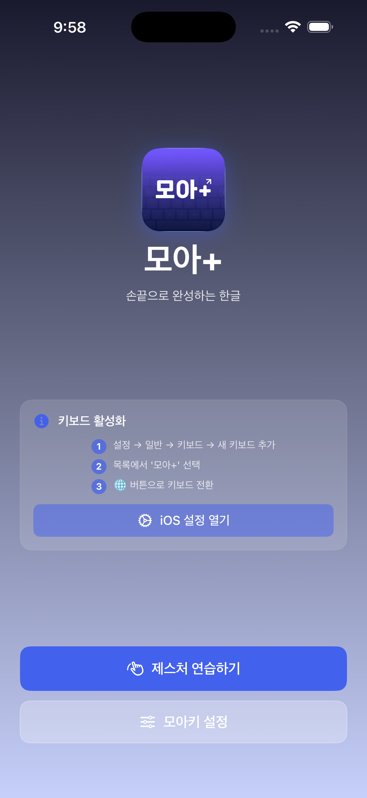
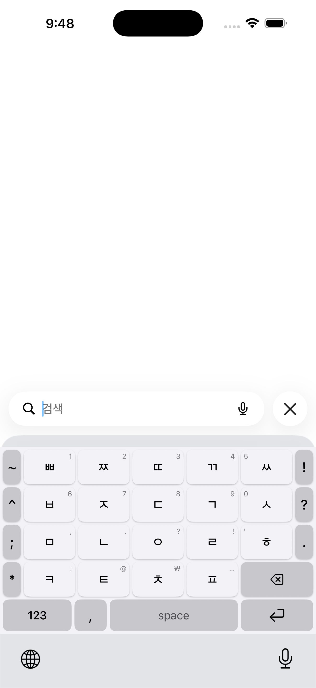
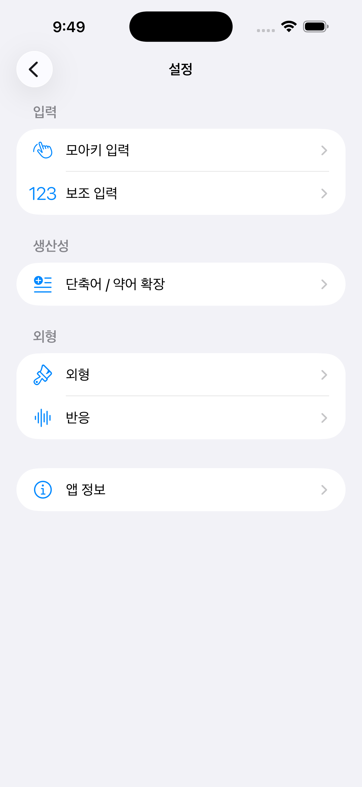
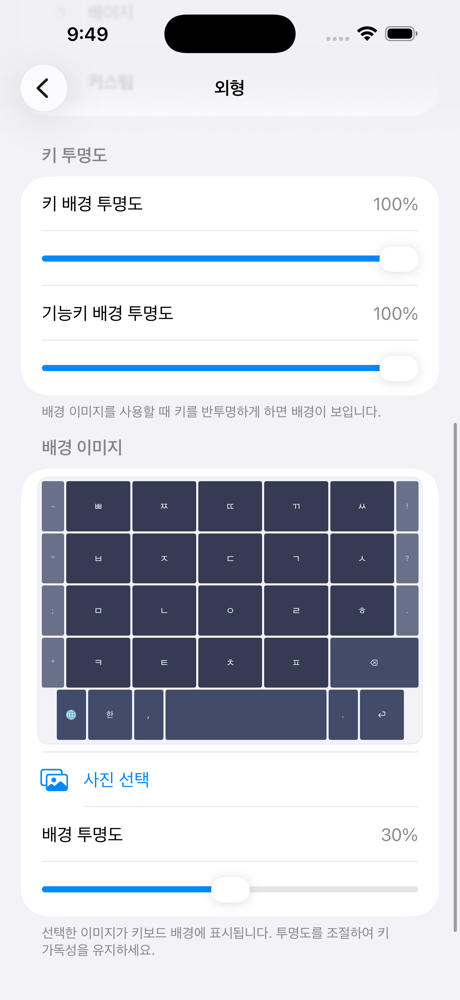
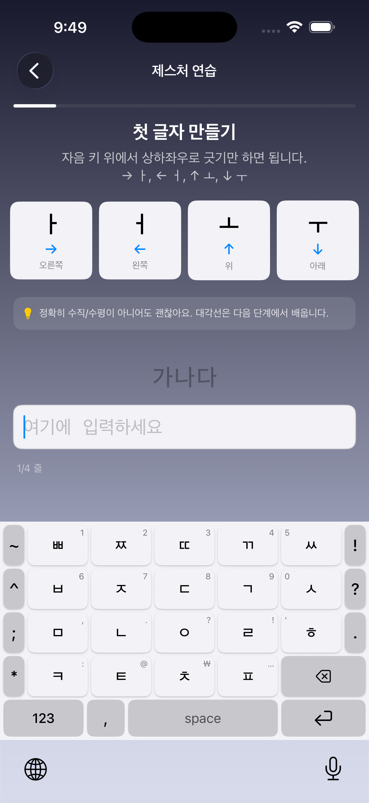
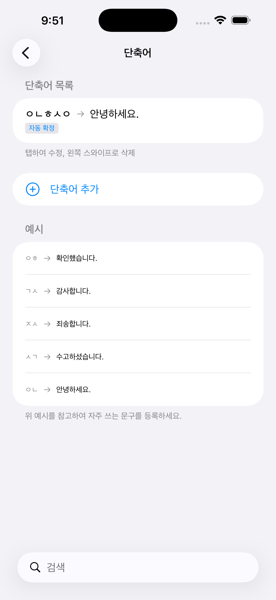
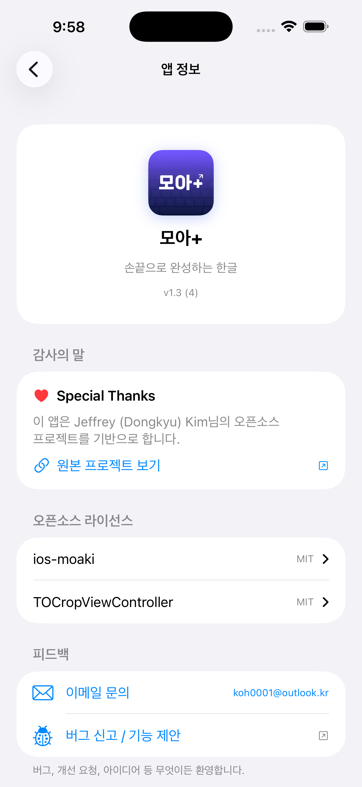

[한국어](README.md)

# Moa+

> Korean at your fingertips — Gesture-based iOS Hangul Keyboard

Swipe on consonant keys to input vowels. All 21 Korean vowels through intuitive 8-directional gesture combinations.

> Based on [ios-moaki](https://github.com/vkehfdl1/ios-moaki) by Jeffrey (Dongkyu) Kim

## Screenshots

| Home | Keyboard | Settings | Appearance |
|:--:|:--:|:--:|:--:|
|  |  |  |  |

| Tutorial | Abbreviation | About |
|:--:|:--:|:--:|
|  |  |  |

## Features

- **Gesture vowel input** — 8-directional swipe on consonant keys for all 21 vowels
- **Long-press auxiliary input** — Hold for numbers/symbols, drag to select candidates
- **Abbreviation expansion** — Type a few consonants to expand into full phrases (e.g. ㅇㅎ → 확인했습니다)
- **Custom themes** — 5 presets + custom colors + background image + key opacity
- **Direction mapping customization** — Configure diagonal vowel mappings and angle ranges
- **Per-column gesture correction** — Improve accuracy for edge-column keys
- **Word-level delete** — Long-press backspace for fast word-by-word deletion
- **Fully offline** — No network required, no data collection

## Gesture Guide

Drag on a consonant key to input a vowel.

### Basic Vowels + Diagonals

| Direction | Vowel | Direction | Vowel |
|-----------|-------|-----------|-------|
| → | ㅏ (a) | ↗ ↖ | ㅣ (i) |
| ← | ㅓ (eo) | ↘ ↙ | ㅡ (eu) |
| ↑ | ㅗ (o) | | |
| ↓ | ㅜ (u) | | |

> Diagonal mappings are customizable in settings.

### Y-Vowels (Back-and-forth)

| Direction | Vowel | Direction | Vowel |
|-----------|-------|-----------|-------|
| →←→ | ㅑ (ya) | ↑↓↑ | ㅛ (yo) |
| ←→← | ㅕ (yeo) | ↓↑↓ | ㅠ (yu) |

### Compound Vowels

| Direction | Vowel | Direction | Vowel |
|-----------|-------|-----------|-------|
| ↑→ | ㅘ (wa) | →← | ㅐ (ae) |
| ↓← | ㅝ (wo) | ←→ | ㅔ (e) |
| ↑↓ | ㅚ (oe) | →←→← | ㅒ (yae) |
| ↓↑ | ㅟ (wi) | ←→←→ | ㅖ (ye) |
| ↑→← | ㅙ (wae) | ↘↖ | ㅢ (ui) |
| ↓→← | ㅞ (we) | | |

## Keyboard Layout

```
 ~  ㅃ ㅉ ㄸ ㄲ ㅆ  !
 ^  ㅂ ㅈ ㄷ ㄱ ㅅ  ?
 ;  ㅁ ㄴ ㅇ ㄹ ㅎ  .
 *  ㅋ ㅌ ㅊ ㅍ  ⌫
 🌐  한/영  ,  [Space]  .  ⏎
```

Long-press for numbers/symbols:
```
ㅃ→1  ㅉ→2  ㄸ→3  ㄲ→4  ㅆ→5
ㅂ→6  ㅈ→7  ㄷ→8  ㄱ→9  ㅅ→0
```

## Install

### Build

```bash
git clone https://github.com/koh0001/moa-plus.git
cd moa-plus
open MoaPlus.xcodeproj
```

Select the `MoaPlus` scheme in Xcode → Choose device/simulator → `Cmd + R`

### Activate the Keyboard

1. **Settings** → **General** → **Keyboard** → **Add New Keyboard** → Select **Moa+**
2. Tap **Moa+** → Enable **Allow Full Access**
3. Switch to Moa+ using the 🌐 button when typing

> For device installation, see [Build & Install Guide](docs/moakey_ios_custom_docs/03_빌드_및_설치_가이드.md)

## Project Structure

```
moa-plus/
├── MoaPlus/                    # Main app (home, settings, tutorial)
├── MoaPlusKeyboard/            # Keyboard extension
│   ├── Engine/                 # Hangul composition, gesture analysis, abbreviation
│   ├── Models/                 # Jamo, gesture, theme, shortcut models
│   ├── ViewModels/             # Keyboard view model
│   ├── Views/                  # Keyboard UI
│   └── Utilities/              # Settings, metrics, haptics
├── MoaPlusKeyboardTests/       # Unit tests
└── docs/                       # Development docs
```

For detailed architecture, see [CLAUDE.md](CLAUDE.md).

## Acknowledgments

This project is based on [ios-moaki](https://github.com/vkehfdl1/ios-moaki) by Jeffrey (Dongkyu) Kim.
Thank you for making the project open source.

## Credits

- Original project: [ios-moaki](https://github.com/vkehfdl1/ios-moaki) by Jeffrey (Dongkyu) Kim
- Image cropping: [TOCropViewController](https://github.com/TimOliver/TOCropViewController) by Tim Oliver

## License

[MIT License](LICENSE)
