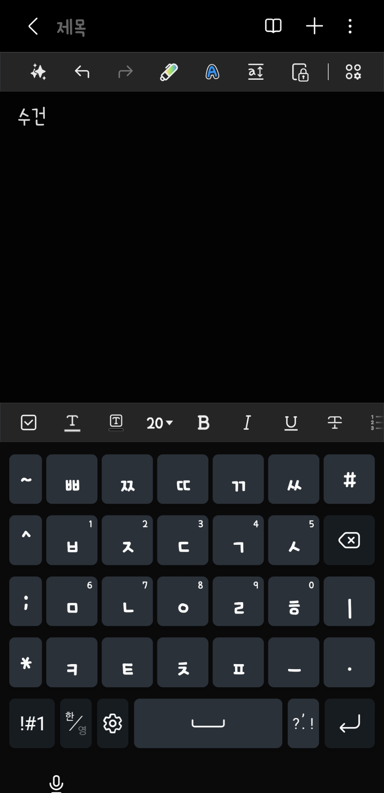
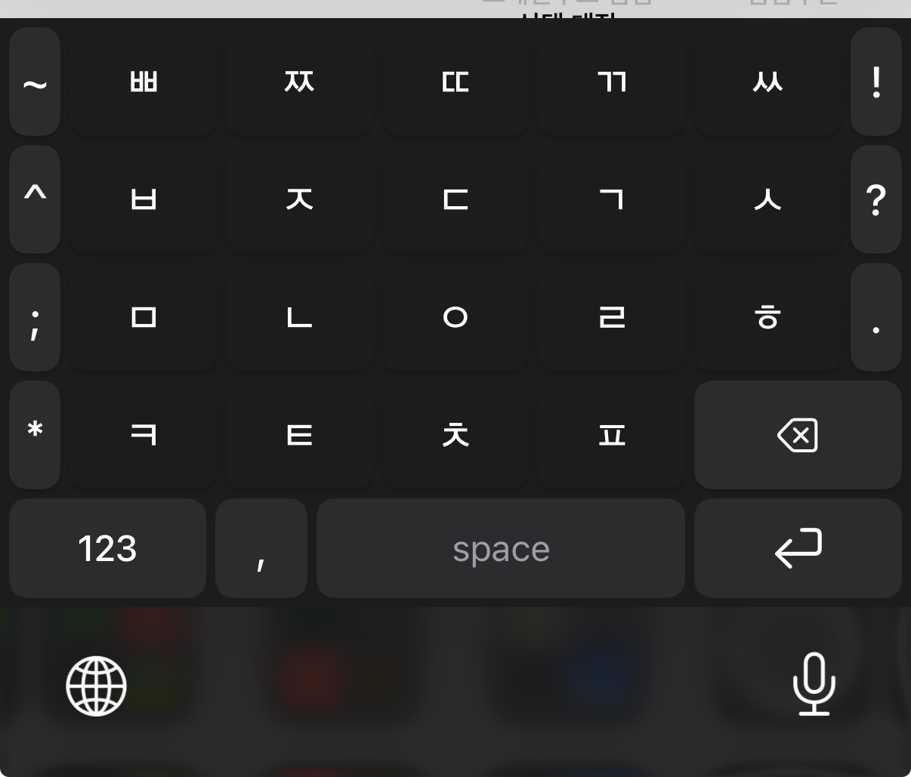

# 레이아웃 분석

## 문서 목적
이 문서는 원본 갤럭시 양손 모아키 레이아웃과 현재 iOS 포크 레이아웃의 차이를 정리하고, iOS 커스텀 키보드에서 목표로 해야 할 구조를 화면 단위로 분해한 작업 문서다.

## 참고 시각 자료

| 원본 갤럭시 양손 모아키 | 현재 iOS 포크 |
|---|---|
|  |  |

## 1. 원본 갤럭시 레이아웃 관찰 결과

### 1.1 핵심 구조
- 좌측 세로 기능열이 존재한다.
- 중앙부에는 자음 키가 정사각형에 가까운 밀도 높은 그리드로 배치된다.
- 우측에는 일반 문장부호처럼 보이지만 실제로는 모음 primitive 입력에 관여하는 키가 존재한다.
- 하단 기능열에는 기호 전환, 한/영, 설정, 스페이스, 문장부호, 엔터 계열 키가 직접 노출된다.
- 전체적으로 `삼성 키보드 레이아웃 위에 모아키를 얹은 구조`라기보다, `모아키 전용 구조를 삼성 UI 스타일로 정리한 레이아웃`에 가깝다.

### 1.2 입력 UX 관점 특징
- 좌우 엄지 사용을 전제로 키 간격과 기능열 위치가 정리되어 있다.
- 중앙 자음 키는 탭/긋기 시작점으로 쓰기 쉬운 크기와 간격을 가진다.
- 가장자리 키는 물리적으로는 동일한 폭처럼 보이지만, 실제 사용감은 바깥쪽 긋기가 불리해질 수 있다.
- 우측 모음/문장부호처럼 보이는 키들은 시각적으로 단순하지만, 의미적으로는 일반 키보드와 다르다.

## 2. 현재 iOS 포크 레이아웃 관찰 결과

### 2.1 현재 구조
- iOS 기본 키보드 구조의 영향을 강하게 받는다.
- 좌우에 세로 기능열이 모두 존재한다.
- 하단에는 `123`, `space`, `return`, `globe`, `mic` 같은 iOS 계열 요소가 보인다.
- 우측의 `!`, `?`, `.`, `backspace`가 세로로 분리되어 있다.
- 전체적으로 `모아키를 iOS 기본 키보드 프레임 안에 넣은 형태`에 가깝다.

### 2.2 사용감 관점 문제
- 원본 갤럭시보다 기능열이 iOS 시스템 키 구조를 더 많이 따라간다.
- 우측 키들의 의미가 모음 primitive 중심인지, 일반 문장부호 중심인지 시각적으로 분리되지 않는다.
- 하단 기능열의 정보 밀도가 낮고, 삼성식 직접 접근성이 약하다.
- 끝열 자음의 바깥쪽 긋기 문제를 레이아웃과 제스처 양쪽에서 동시에 풀어야 한다.

## 3. 레이아웃 갭 정리

| 구분 | 원본 갤럭시 | 현재 iOS 포크 | 목표 방향 |
|---|---|---|---|
| 레이아웃 철학 | 모아키 전용 배치 | iOS 기본 키보드 프레임 우선 | 모아키 전용 배치 우선, iOS 필수키만 하단에 통합 |
| 우측 키 의미 | 모음/보조 입력 성격 | 문장부호처럼 보이는 구조 | 시각은 단순하게 유지하되 semantic 분리 |
| 하단열 | 한/영, 기호, 설정 등 직접 접근성 높음 | iOS 기본 하단 구조 영향 큼 | 모아키 기능 우선, 시스템 키는 최소 필수 노출 |
| 키 밀도 | 촘촘하고 대칭적 | 세로열 분리감이 큼 | 중앙 자음 그리드 중심으로 재정렬 |
| 끝열 사용감 | 원본도 보정이 필요할 수 있음 | iOS에서 특히 바깥 긋기 불리 | 보조문자 위치 + 제스처 보정 동시 적용 |

## 4. 목표 레이아웃 원칙

### 원칙 1. 자음 입력 영역이 레이아웃의 중심이어야 한다
- 사용자의 시선은 자음 그리드에 먼저 고정되어야 한다.
- 기능열은 보조적이어야 하며, 자음 키의 시각적 중심을 빼앗으면 안 된다.

### 원칙 2. 모음 primitive 키는 시각과 의미를 분리한다
- 겉보기에 `.` 또는 `ㅣ`처럼 보일 수 있다.
- 내부 동작은 `ㆍ`, `ㅣ`, `ㅡ` primitive로 처리한다.
- 따라서 디자인 문서와 구현 문서에서 일반 문장부호 키와 명확히 구분해야 한다.

### 원칙 3. 하단열은 iOS 필수 키와 모아키 기능 키를 혼합하되, 모아키 UX를 우선한다
- 시스템 키보드 전환 키는 필요하지만, 기호 레이어 진입은 모아키 방식으로 더 빠르게 제공한다.
- `짧게 탭 = 내부 특수문자 레이어`, `길게 누름 = 시스템 키보드 전환` 구조를 기본안으로 본다.

### 원칙 4. 끝열 키는 레이아웃에서부터 배려한다
- 작은 보조문자를 키 모서리 끝이 아니라 안쪽으로 배치한다.
- 시각 중심이 키 외곽으로 끌리지 않게 한다.
- 제스처 보정은 엔진에서 하되, 레이아웃도 동시에 협조해야 한다.

## 5. 추천 레이아웃 분해

### 5.1 상단 메인 영역
- 좌측 세로 기능열
- 중앙 자음 그리드
- 우측 모음/보조 열

### 5.2 하단 기능 영역
- 기호 레이어 진입 / 시스템 키보드 전환 겸용 키
- 한/영 전환
- 설정 혹은 기능 진입
- 스페이스
- 문장부호 퀵키
- 엔터

## 6. 레이아웃 구현 정책

### 6.1 키 종류 분류
- `ConsonantKey`
- `VowelPrimitiveKey`
- `FunctionalKey`
- `QuickPunctuationKey`
- `SystemSwitchKey`

### 6.2 키캡 라벨 정책
- 메인 라벨: 중앙 큰 자음/기능명
- 보조 라벨: 우상단 작은 힌트
- 끝열은 보조 라벨을 안쪽 오프셋 적용

### 6.3 하단키 정책
- iOS 필수 시스템 키는 존재해야 한다.
- 하지만 사용 빈도가 높은 모아키 기능은 별도 진입 없이 바로 접근 가능해야 한다.
- 따라서 `모아키 내부 기능`과 `iOS 시스템 기능`을 동일한 레벨로 두면 안 된다.

## 7. 1차 레이아웃 작업안

### A안: 원본 복원 우선
- 자음 그리드와 우측 모음키 위치를 최대한 원본처럼 재배치
- 하단 기능열도 삼성 느낌에 더 가깝게 구성
- 장점: 원본 감각 복원 유리
- 단점: iOS 시스템 키와의 결합 설계 필요

### B안: iOS 시스템 구조 절충
- 현재 포크 구조를 유지하되 모아키 의미 구조만 재정의
- 장점: 구현 난이도 낮음
- 단점: 원본 감각 복원 한계가 큼

### 권장안
- **A안 기반 + iOS 필수 키만 최소 절충**
- 즉, 레이아웃 철학은 원본 복원 우선으로 두고 시스템 키는 하단 기능열에 최소한으로 통합한다.

## 8. 작업 체크리스트
- [ ] 현재 저장소의 레이아웃 정의 파일 위치 파악
- [ ] 자음/기능/모음 primitive 키 타입 분리 가능 여부 확인
- [ ] 현재 우측 기능열이 semantic 기준으로 어떻게 구현되어 있는지 확인
- [ ] 하단열의 globe / mic / 123 처리 정책 확인
- [ ] 원본 갤럭시의 실제 숫자/보조문자 배치 캡처 추가 수집
- [ ] 원본과 포크를 비교한 레이아웃 와이어프레임 초안 작성
