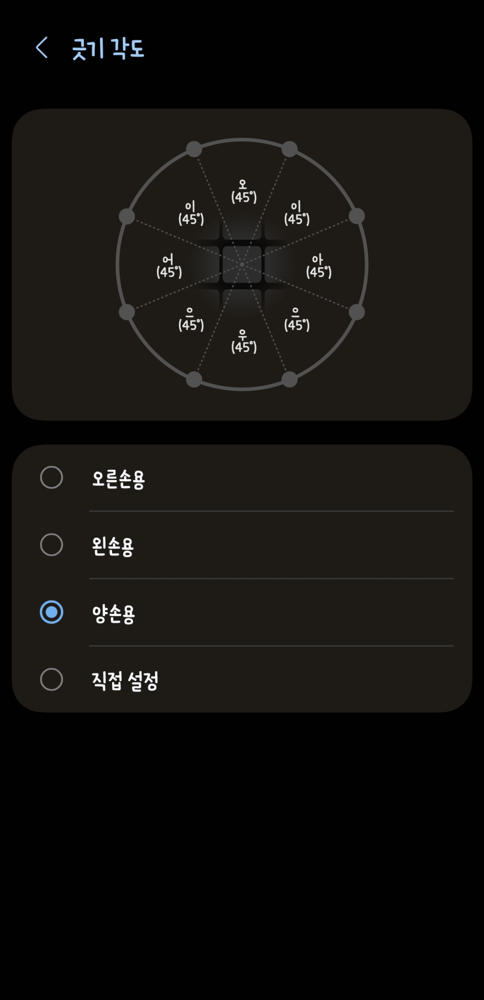
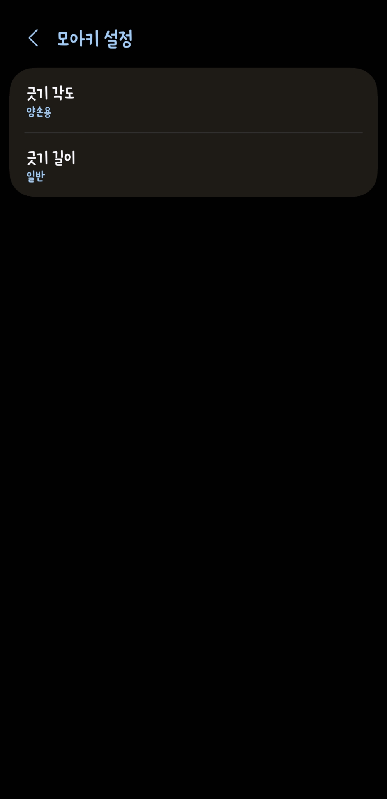

# 제스처 엔진 분석

## 문서 목적
이 문서는 모아키 iOS 커스텀 키보드의 핵심인 탭/긋기/롱프레스 입력 판정 구조를 정리하고, 원본 사용감 복원을 위해 필요한 엔진 파라미터를 정의한다.

## 참고 시각 자료

| 긋기 각도 양손용 45도 프리셋 | 모아키 설정 화면 |
|---|---|
|  |  |

## 1. 입력 엔진의 핵심 문제
모아키는 일반 쿼티 키보드처럼 `탭 = 문자 확정`으로 끝나지 않는다. 기본적으로 아래 이벤트가 충돌한다.

- 탭
- 긋기(swipe)
- 롱프레스
- 롱프레스 후 팝업 선택
- 약어 확장 확정

따라서 제스처 엔진은 단순 `gesture recognizer`가 아니라 `입력 우선순위 엔진`으로 설계해야 한다.

## 2. 판정 우선순위

### 권장 우선순위
1. 탭/터치다운 시작
2. 이동 거리 계산
3. 긋기 길이 threshold 초과 여부 판단
4. 초과 시 각도 분류로 swipeCandidate 진입
5. threshold 미만 상태가 유지되면 longPress 대기
6. longPress 시간 도달 시 보조입력 팝업 진입
7. 문자 확정 후 delimiter 발생 시 약어 확장 후보 검사

### 핵심 원칙
- **빠르게 움직이면 긋기 우선**
- **가만히 누르면 롱프레스 우선**
- **문자 확정 이후에만 약어 확장 검사**

## 3. 긋기 각도

### 3.1 의미
긋기 각도는 `이동 방향을 어떤 모음/출력으로 판정할지`를 정하는 방향 분류 규칙이다.

### 3.2 사용자 옵션
- 오른손용
- 왼손용
- 양손용
- 직접 설정

### 3.3 양손용 프리셋
양손용은 8방향 균등 분할, 각 45도 기준으로 보는 것이 타당하다.

### 3.4 직접 설정 확장 방향
현재 삼성은 전역 각도 계열 중심으로 보이지만, iOS 커스텀 목표는 **세로 라인별 override**까지 제공하는 것이다.

## 4. 긋기 길이

### 4.1 의미
긋기 길이는 스와이프 인정 최소 이동 거리 threshold다.

### 4.2 enum
- 짧게
- 보통
- 길게

### 4.3 엔진 내부 처리
UI는 enum으로만 노출하고, 내부에서는 포인트 단위 threshold로 환산한다.

```text
short  -> shortThreshold
normal -> normalThreshold
long   -> longThreshold
```

### 4.4 체감 효과
- 짧게: 민감, 빠름, 오입력 위험 증가
- 보통: 균형형
- 길게: 안정적, 다소 둔함

## 5. 세로 라인별 제스처 보정

### 5.1 필요한 이유
중앙부는 각도 분류가 비교적 잘 맞는 편이지만, 좌우 끝열 및 사이드 열은 바깥 방향 긋기가 불리하다. 특히 다음 키 그룹에서 `ㅡ`, `ㅣ` 입력 불편이 발생하기 쉽다.

- 1열: `ㅃ, ㅂ, ㅁ, ㅋ`
- 2열: `ㅉ, ㅈ, ㄴ, ㅌ`
- 4열: `ㄲ, ㄱ, ㄹ, ㅍ`
- 5열: `ㅆ, ㅅ, ㅎ`

### 5.2 왜 per-key보다 column override가 우선인가
- 설정량이 적다.
- 사용자가 이해하기 쉽다.
- 대부분의 편향이 키 개별 문제보다 열 단위로 묶인다.
- 이후 예외 케이스에만 key override로 확장 가능하다.

### 5.3 권장 파라미터
- `rotationOffsetDeg`
- `verticalIWidthDelta`
- `horizontalEuWidthDelta`
- `outwardDistanceMultiplier`

### 5.4 끝열 보정
왼쪽 끝열과 오른쪽 끝열은 별도 outward 가중치를 두는 것이 좋다.

```text
leftEdgeOutwardDistanceMultiplier
rightEdgeOutwardDistanceMultiplier
```

## 6. 보조 힌트와 제스처 엔진의 관계
작은 특수문자 힌트는 단순 시각 요소가 아니라 입력 정확도에 영향을 준다.

### 문제
- 끝열에서 작은 힌트가 바깥쪽에 있으면 시선이 외곽으로 끌린다.
- 터치 시작점이 흔들리면 outward swipe가 더 불리해진다.

### 대응
- 힌트 크기 조절
- 힌트 안쪽 정렬
- 끝열 바깥 방향 swipe 완화

즉, `렌더링 보정`과 `제스처 보정`은 같이 가야 한다.

## 7. 롱프레스와 긋기의 충돌 처리

### 원칙
- 터치 후 빠르게 이동하면 swipe
- 터치 후 유지되면 longPress
- move 이벤트가 일정 거리 이상 발생하면 longPress 예약 취소

### 필요 파라미터
- `longPressDelayMs`
- `movementToleranceForLongPress`
- `swipeActivationDistance`

## 8. 약어 확장과의 연결
약어 확장은 키 입력 판정을 대신하면 안 된다. 엔진 구조상 항상 마지막 단계에 와야 한다.

### 흐름
1. 키 입력/긋기/보조입력 확정
2. 텍스트 버퍼 갱신
3. delimiter 입력 시 trigger 후보 검사
4. 치환 후보 표시 혹은 자동 확정
5. 직후 backspace 시 원문 복원

## 9. 권장 데이터 모델

```text
SwipeProfile
- mode: right | left | both | custom
- sectorAngles[8]
- minSwipeDistance

ColumnGestureOverride
- columnId: 1..5
- rotationOffsetDeg
- verticalISectorDeltaDeg
- horizontalEuSectorDeltaDeg
- outwardDistanceMultiplier

GestureRuntimeState
- touchStartPoint
- touchCurrentPoint
- currentDistance
- currentAngle
- currentSector
- isSwipeCandidate
- isLongPressCandidate
```

## 10. 디버그/튜닝 기능 제안
엔진 품질을 올리려면 디버그 모드가 필요하다.

### 추천 기능
- 현재 각도 벡터 시각화
- sector 하이라이트 오버레이
- threshold 원 표시
- 열별 보정값 on/off 비교
- 특정 키의 outward swipe 성공률 로그

## 11. 구현 체크리스트
- [ ] 현재 포크 저장소의 gesture recognizer 구조 파악
- [ ] 탭/스와이프/롱프레스 이벤트 순서 확인
- [ ] 현재 각도 분류가 전역 상수인지, 키별 확장이 가능한 구조인지 확인
- [ ] length enum을 실제 threshold 값으로 연결할 위치 파악
- [ ] column override 저장 모델과 런타임 적용 지점 설계
- [ ] 디버그 오버레이 개발용 플래그 설계
